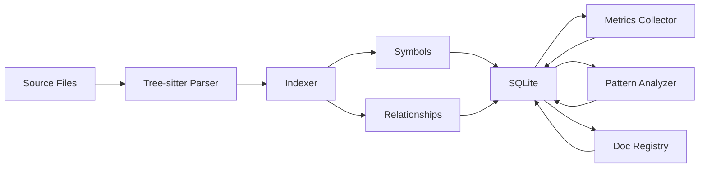
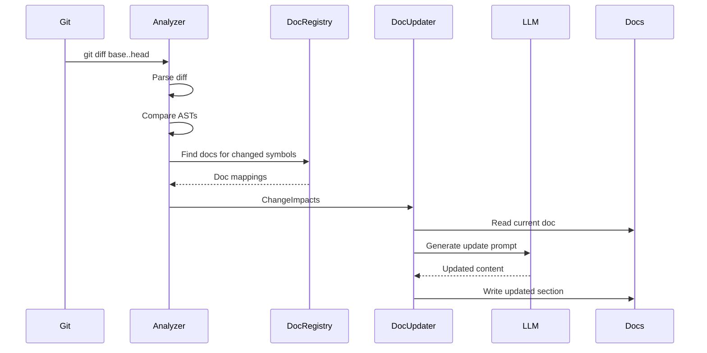
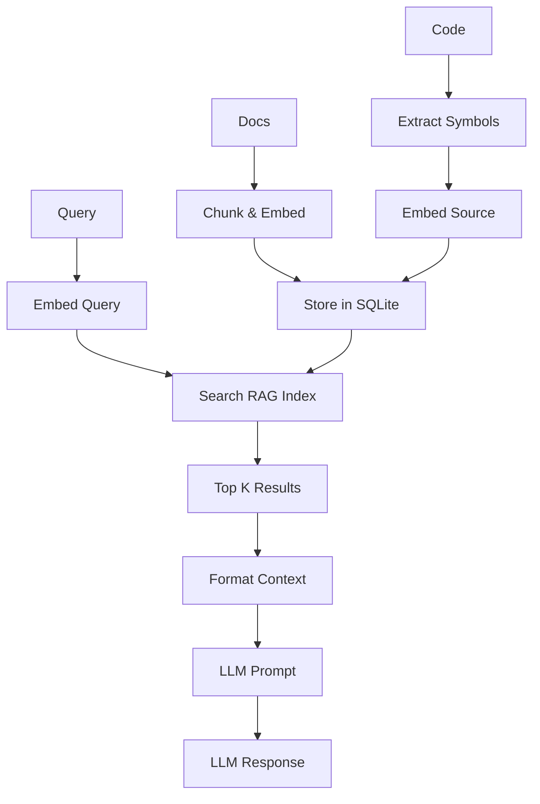
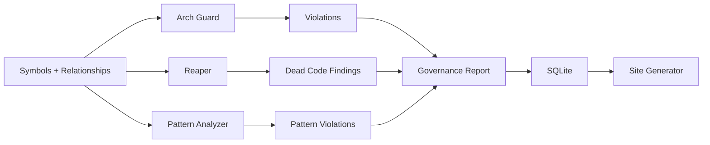

# Arquitetura do docs-kit

> Visão geral da arquitetura, fluxos de dados e integração entre módulos.

## Visão Geral

O **docs-kit** é um agente de documentação inteligente que usa Tree-sitter para análise de código e LLMs para geração contextual. Ele combina análise estática, grafos de conhecimento e RAG (Retrieval-Augmented Generation) para manter documentação sincronizada com código.

## Arquitetura em Camadas

```
┌─────────────────────────────────────────────────────────────┐
│                    Interface Layer                          │
│  ┌─────────────┐              ┌─────────────────┐          │
│  │   CLI       │              │   MCP Server    │          │
│  │ (Terminal)  │              │   (LLM Tools)   │          │
│  └──────┬──────┘              └────────┬────────┘          │
└─────────┼─────────────────────────────┼───────────────────┘
          │                             │
┌─────────┼─────────────────────────────┼───────────────────┐
│         │        Core Services        │                   │
│  ┌──────▼────────┐    ┌──────────────▼──────────┐        │
│  │   Indexer     │    │      Doc Manager        │        │
│  │  - Parse AST  │    │   - Registry           │        │
│  │  - Symbols    │    │   - Updater            │        │
│  │  - Relations  │    │   - Scanner            │        │
│  │  - Metrics    │    │   - Validator          │        │
│  └───────┬───────┘    └─────────┬───────────────┘        │
│          │                      │                         │
│  ┌───────▼──────────────────────▼──────────┐             │
│  │           Knowledge Engine              │             │
│  │  - Graph (Dependencies)                 │             │
│  │  - RAG (Semantic Search)                │             │
│  │  - Context Builder                      │             │
│  └─────────────────┬────────────────────────┘             │
└────────────────────┼───────────────────────────────────────┘
                     │
┌────────────────────┼───────────────────────────────────────┐
│                    │    Analysis Layer                     │
│  ┌─────────────────▼─────────────────┐                    │
│  │         Analyzer                  │                    │
│  │  - Git Diff Parser               │                    │
│  │  - AST Diff                      │                    │
│  │  - Change Detection              │                    │
│  └──────────────────────────────────┘                    │
│                                                            │
│  ┌──────────────────────────────────┐                    │
│  │         Governance               │                    │
│  │  - Arch Guard                    │                    │
│  │  - Reaper (Dead Code)            │                    │
│  │  - Pattern Analyzer              │                    │
│  │  - Smart Code Review             │                    │
│  └──────────────────────────────────┘                    │
└────────────────────────────────────────────────────────────┘
          │                             │
┌─────────┼─────────────────────────────┼───────────────────┐
│         │      Integration Layer      │                   │
│  ┌──────▼─────────┐         ┌────────▼────────┐          │
│  │  LLM Provider  │         │    Storage      │          │
│  │  - OpenAI      │         │    - SQLite     │          │
│  │  - Claude      │         │    - Repos      │          │
│  │  - Gemini      │         │    - Schema     │          │
│  │  - Ollama      │         └─────────────────┘          │
│  └────────────────┘                                       │
└────────────────────────────────────────────────────────────┘
          │
┌─────────▼──────────────────────────────────────────────────┐
│                    Output Layer                            │
│  ┌──────────────┐              ┌──────────────┐           │
│  │  Site Gen    │              │  Reports     │           │
│  │  - HTML      │              │  - Status    │           │
│  │  - Markdown  │              │  - Metrics   │           │
│  │  - Diagrams  │              │  - Review    │           │
│  └──────────────┘              └──────────────┘           │
└────────────────────────────────────────────────────────────┘
```

## Fluxo de Dados Principal

### 1. Indexação (Index Flow)



**Etapas:**
1. **Scan**: Fast-glob encontra arquivos usando patterns do config
2. **Parse**: Tree-sitter gera AST para cada arquivo
3. **Extract**: Indexer extrai símbolos (classes, funções, etc.)
4. **Relate**: RelationshipExtractor detecta dependências
5. **Measure**: MetricsCollector calcula complexidade e coverage
6. **Analyze**: PatternAnalyzer detecta design patterns
7. **Map**: DocRegistry vincula símbolos a docs
8. **Persist**: Tudo é salvo no SQLite com transações

### 2. Atualização de Docs (Doc Update Flow)



**Etapas:**
1. **Git Diff**: Compara branches (base vs head)
2. **Parse Diff**: Extrai arquivos e hunks modificados
3. **AST Diff**: Compara ASTs old vs new
4. **Detect Changes**: Identifica símbolos afetados
5. **Locate Docs**: DocRegistry encontra docs relacionados
6. **Surgical Update**: DocUpdater atualiza seções específicas
7. **LLM Enhancement** (opcional): Gera conteúdo contextual

### 3. Busca Semântica (RAG Flow)



**Etapas:**
1. **Index Building**:
   - Docs são chunked por seção
   - Código é chunked por símbolo
   - Embeddings são gerados via LLM provider
   - Armazenados no SQLite (tabela `rag_chunks`)

2. **Query Time**:
   - Query do usuário é embedded
   - Cosine similarity calcula scores
   - Top K chunks são retornados
   - Context é formatado para LLM

### 4. Governança (Governance Flow)



**Etapas:**
1. **Arch Guard**: Valida regras arquiteturais (layers, naming, metrics)
2. **Reaper**: Detecta dead code, orphan docs, broken links
3. **Pattern Analyzer**: Valida design patterns (SOLID, etc.)
4. **Aggregate**: Combina findings em relatório único
5. **Persist**: Salva violations no SQLite
6. **Report**: Gera HTML/Markdown com findings

## Padrões de Design

### 1. Repository Pattern (Storage)

Abstrai acesso ao SQLite:

```typescript
interface SymbolRepository {
  upsert(symbol: CodeSymbol): void;
  findById(id: string): CodeSymbol | undefined;
  findByName(name: string): CodeSymbol[];
}
```

**Benefícios:**
- Testável (mock repositories)
- Desacoplado da implementação
- Transações encapsuladas

### 2. Strategy Pattern (LLM Providers)

Permite trocar providers transparentemente:

```typescript
interface LlmProvider {
  chat(messages: ChatMessage[]): Promise<string | null>;
  embed(texts: string[]): Promise<number[][]>;
}

// Factory cria provider correto
const llm = createLlmProvider(config);
```

**Benefícios:**
- Suporte multi-provider
- Fácil adicionar novos
- Testável com mocks

### 3. Factory Pattern (Provider Creation)

```typescript
function createLlmProvider(config: Config): LlmProvider {
  switch (config.llm.provider) {
    case "openai": return new OpenAIProvider({...});
    case "claude": return new ClaudeProvider({...});
    // ...
  }
}
```

### 4. Builder Pattern (Context Building)

```typescript
const context = await buildRelevantContext(
  { symbolName: "OrderService" },
  { registry, symbolRepo, graph, ... }
);
```

Monta contexto progressivamente (símbolo → deps → docs → source).

### 5. Observer Pattern (Event Flow Analysis)

Detecta event emitters e listeners para gerar sequence diagrams.

## Princípios Arquiteturais

### 1. Single Responsibility

Cada módulo tem uma responsabilidade clara:
- **Indexer**: Extração de símbolos
- **Analyzer**: Detecção de mudanças
- **Docs**: Gestão de documentação
- **Governance**: Validação de qualidade

### 2. Separation of Concerns

Camadas não se misturam:
- **Interface** (CLI/MCP) não contém lógica de negócio
- **Core Services** são agnósticos de UI
- **Storage** é isolado em repositories

### 3. Dependency Inversion

Core services dependem de abstrações (interfaces), não de implementações concretas.

```typescript
// ✅ Depends on abstraction
class DocUpdater {
  constructor(private llm: LlmProvider) {}
}

// ❌ Depends on concrete
class DocUpdater {
  constructor(private llm: OpenAIProvider) {}
}
```

### 4. Don't Repeat Yourself (DRY)

Código compartilhado é extraído:
- `shared.ts` em cada módulo
- Utilities centralizadas
- Templates reutilizáveis

### 5. Incremental Processing

Evita reprocessamento desnecessário:
- **File hashes**: Skip arquivos não modificados
- **Doc mappings cache**: Registry mantém cache
- **Prepared statements**: SQLite reutiliza queries

## Fluxos de Integração

### 1. CI/CD Integration (Doc Guard)

```yaml
# .github/workflows/pr.yml
- name: Index repo
  run: docs-kit index

- name: Check docs updated
  run: docs-kit docs-guard --base main --head ${{ github.sha }}
```

**Resultado:**
- ✅ Pass: Docs atualizadas para símbolos modificados
- ❌ Fail: Símbolos modificados sem atualização de docs

### 2. Claude Desktop Integration (MCP)

```json
// ~/Library/Application Support/Claude/mcp.json
{
  "mcpServers": {
    "docs-kit": {
      "command": "node",
      "args": ["/path/to/docs-kit/dist/server.js"],
      "cwd": "/path/to/project"
    }
  }
}
```

**Ferramentas disponíveis:**
- `generateDocs`: Atualiza docs para mudanças
- `explainSymbol`: Explica símbolo com contexto
- `impactAnalysis`: Analisa raio de impacto
- `askKnowledgeBase`: Q&A sobre código/docs

### 3. VS Code Extension (Future)

```typescript
// Extension commands
vscode.commands.registerCommand('docs-kit.explainSymbol', async () => {
  const symbol = getCurrentSymbol();
  const explanation = await mcpClient.call('explainSymbol', { symbol });
  vscode.window.showInformationMessage(explanation);
});
```

## Performance e Escalabilidade

### Current Performance

**Indexing:**
- 1000 arquivos: ~30s
- 10,000 símbolos: ~45s
- Bottleneck: I/O (read files)

**Doc Updates:**
- Analyze changes: ~2s
- Update 10 docs: ~15s (com LLM)
- Bottleneck: LLM latency

**Site Generation:**
- 10,000 símbolos: ~30s
- Output: ~10MB HTML
- Bottleneck: File writes

### Optimizations Applied

1. **Incremental Indexing**: File hash tracking
2. **Batch Operations**: SQLite transactions
3. **Prepared Statements**: Query reuse
4. **Parallel Reads**: Promise.all para arquivos

### Future Improvements

1. **Worker Threads**: Parallel AST parsing
2. **Approximate NN**: FAISS para RAG search
3. **Cache Layer**: Redis para contextos frequentes
4. **Streaming LLM**: Reduce latency
5. **Delta Updates**: Atualiza só o que mudou no site

## Testabilidade

### Dependency Injection

```typescript
// ✅ Testable
const updater = createDocUpdater({ llm: mockLlm });

// Mock
const mockLlm: LlmProvider = {
  chat: jest.fn().mockResolvedValue("Mock response"),
  embed: jest.fn().mockResolvedValue([[0.1, 0.2]])
};
```

### Repository Mocks

```typescript
const mockRepo: SymbolRepository = {
  findByName: jest.fn().mockReturnValue([mockSymbol]),
  // ...
};
```

### Test Coverage

- **Unit Tests**: 85%+ coverage target
- **Integration Tests**: CLI commands, MCP tools
- **E2E Tests**: Full indexing → site generation flow

## Segurança

### API Keys

Armazenadas em environment variables, nunca no código:

```bash
OPENAI_API_KEY=sk-...
ANTHROPIC_API_KEY=sk-ant-...
```

### SQL Injection

Prevenido com prepared statements:

```typescript
// ✅ Safe
db.prepare("SELECT * FROM symbols WHERE name = ?").get(name);

// ❌ Vulnerable
db.prepare(`SELECT * FROM symbols WHERE name = '${name}'`).get();
```

### Input Validation

Zod schemas validam configuração:

```typescript
const configSchema = z.object({
  llm: z.object({
    provider: z.enum(["openai", "claude", "gemini", "ollama"]),
    model: z.string()
  })
});
```

## Deployment

### Local Development

```bash
git clone https://github.com/marcuspmd/docs-kit
cd docs-kit
npm install
npm run build
npm link  # Instala globalmente
```

### Production

```bash
npm install -g docs-kit
docs-kit init
docs-kit index
docs-kit build-site
```

### Docker (Future)

```dockerfile
FROM node:20-alpine
WORKDIR /app
COPY package*.json ./
RUN npm ci --production
COPY dist ./dist
CMD ["node", "dist/cli.js", "index"]
```

## Monitoring e Observabilidade

### Logging

```typescript
console.log("Info: Indexing 1000 files...");
console.error("Error: Failed to parse file:", err);
console.warn("Warning: Symbol not found:", name);
```

### Metrics (Future)

- Index duration
- LLM token usage
- Error rates
- Cache hit ratio

### Tracing (Future)

OpenTelemetry para distributed tracing.

## Extensibilidade

### Adding New Language

1. Install Tree-sitter parser
2. Create `LanguageParser` implementation
3. Register in `indexer.ts`

### Adding New LLM Provider

1. Create `MyProvider implements LlmProvider`
2. Register in `createLlmProvider()` factory
3. Update Config schema

### Adding New Governance Rule

1. Add rule type to `RuleType` enum
2. Implement check logic in `archGuard.ts`
3. Update `arch-guard.json` schema

## Referências

- [Módulo CLI](./modules/cli.md)
- [Módulo MCP Server](./modules/mcp-server.md)
- [Módulo Indexer](./modules/indexer.md)
- [Módulo Docs](./modules/docs.md)
- [Módulo Governance](./modules/governance.md)
- [Módulo Knowledge](./modules/knowledge.md)
- [Módulo LLM](./modules/llm.md)
- [Módulo Storage](./modules/storage.md)
- [Módulo Site](./modules/site.md)
